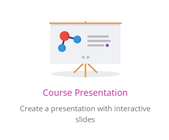
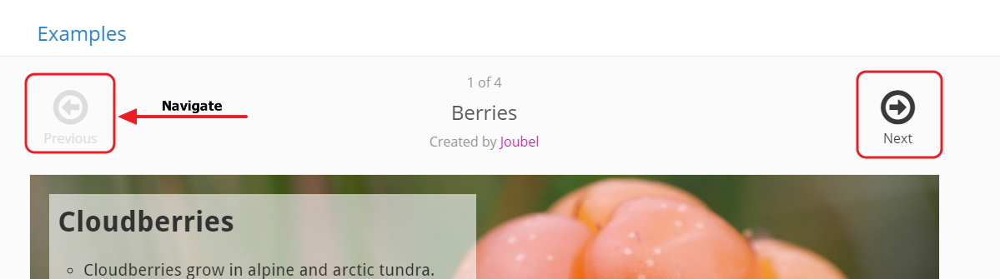
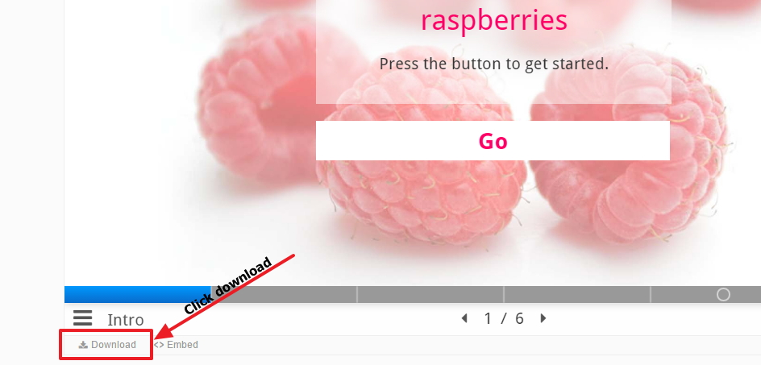

# Lets get started

All of the content types are available in Look <a href="https://h5p.org/content-types-and-applications" target="_blank">H5P</a>

## H5P

You will need to log on to H5P, available via Look <a href="https://h5p.org/content-types-and-applications" target="_blank">this link</a>

## Course Presentation

Click on the following content type

Navigate through the different examples 

Click download (bottom left corner)

You should now have an archive folder in .h5p file extension in your download folder
