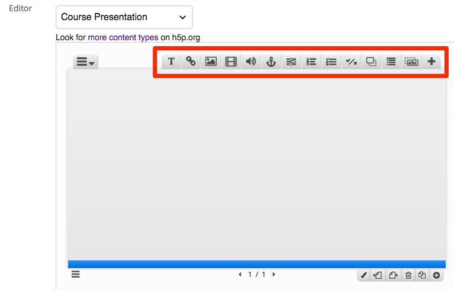
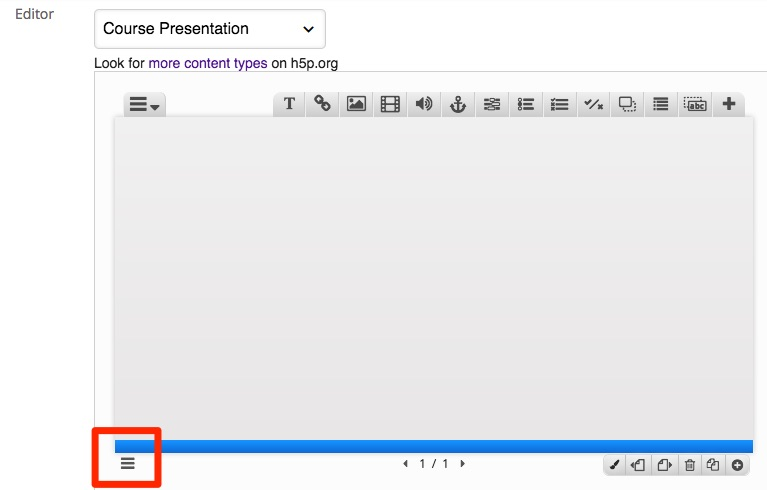
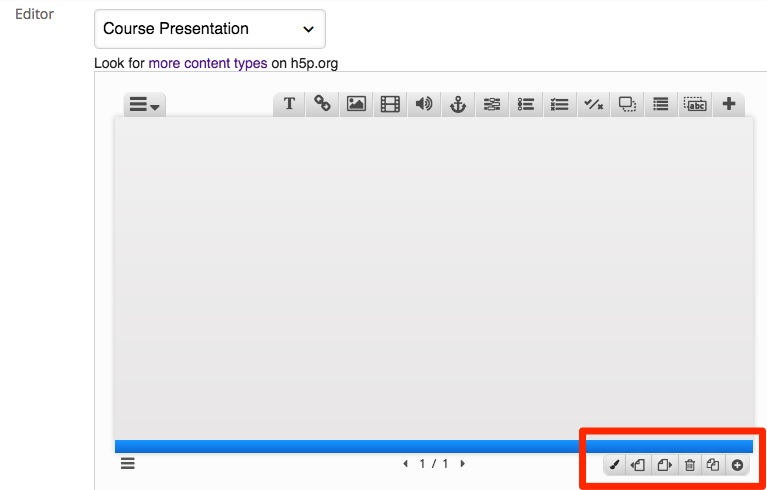
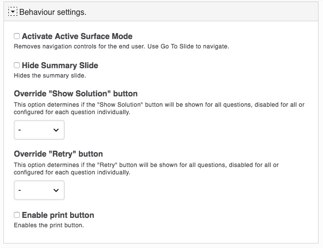
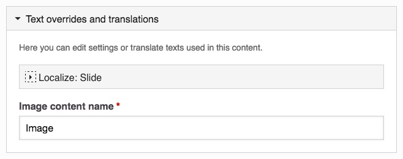

# In Moodle

## Adding Content

This is where you will have to be creative and create you own content. Look <a href="https://h5p.org/content-types-and-applications" target="_blank">here</a> for more ideas around Course Presentations. 

The content window for the Course Presentation type allows you yo insert Pictures, Text, Links, Audio, Video etc - see image below

## Adding Keywords to each slide

You can also add keywords to each slide

## Adding slide

Add slides, Delete slide etc

## Slide Settings

Decide on how your slide behave

Decide on how you content behaves such as feedback, transitions. titles. links etc

