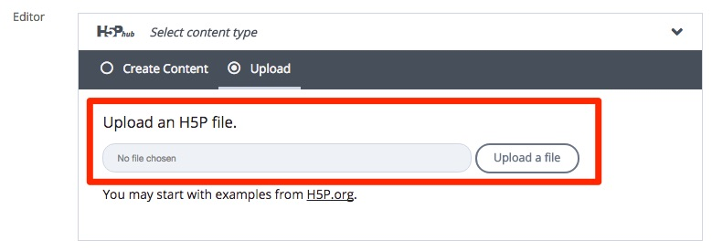

# In Moodle

Log in Moodle

## Choose a module

You must first decide on which module you want to use this content type and in which section inside the module.

## Upload to Moodle

Turn editing on and click on add and activity or resource, you will see this screen.

Choose the Interactive content type, you will then see the following screen. 

Give your content type a name and fill in the description, you will then have the option to upload or create your plug-in of choice.

The best option is to upload the content type you downloaded from H5P and modify you content accordingly.

If you choose to create from scratch then you must choose the content type

