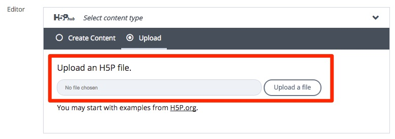
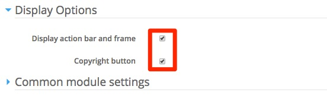
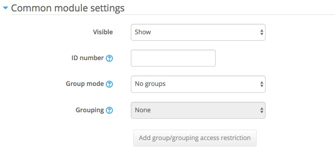
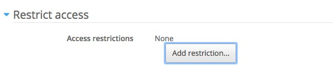

# Back in Moodle

As mentioned previously the best option is to download your content type from <a href="https://h5p.org/content-types-and-applications" target="_blank">here</a>

## Settings

First you will need to upload the h5p file, click **Upload a file** and select the file you just downloaded from h5p

After you choose the file you will need to click **Use**

We will look at the interactive video editor settings in step 04, for now lets continue will some of the final settings.

# Display Settings

Make sure you un-tick both options in display settings

# Other Settings

You might also want to add some extra settings such as setting up group mode or grouping visibility and you may also want to restrict to particular groups etc.

OR

