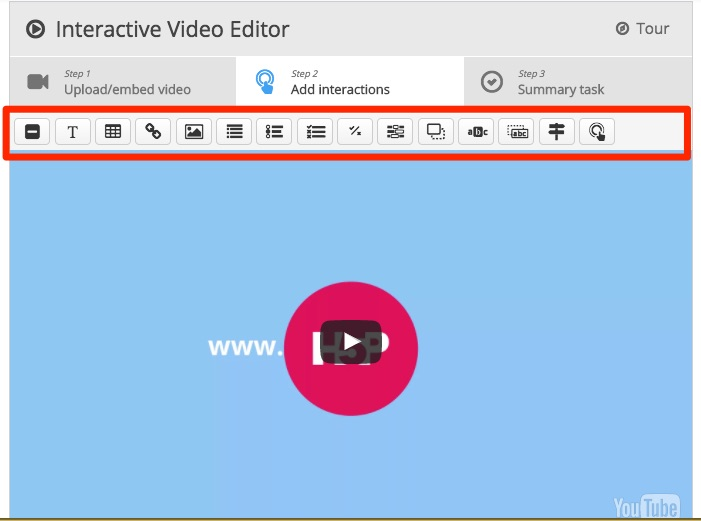

# Interactive Video Editor Settings

When you upload the file you will also notice that you can also add interactive content to your video or select your own video file or a video from Youtube

## Step 1 - add or delete video

Now you can add your own video, all you have to do is copy the URL of the video on Youtube or upload your own video by clicking on add+

You can also edit the copyright

## Start Screen and Track Settings

You can change the settings such the Title of the Video and any copy right information, you can also insert subtitles or captions at certain points on the video. 

## Interactive Settings

To make you video interactive this is when you insert components such as text, hyper-links, Choices (i.e Multiple Choice) True or False questions, Fill in the Blanks, Drag and Drop, Crossroads etc

## Behavior and override Settings

You can change the the behavior of the video such when it starts, if the video loops, prevent skipping forward etc. You can also override the text for labels such changing **Play** to **Play Video** etc.

## Adding Summary Statements

When you add interactions you can use the summary statements to aid the students, when you add a statement the first one is correct, subsequent ones are false, note, you can also add a tip. 

When your finished make sure you **save** your changes

